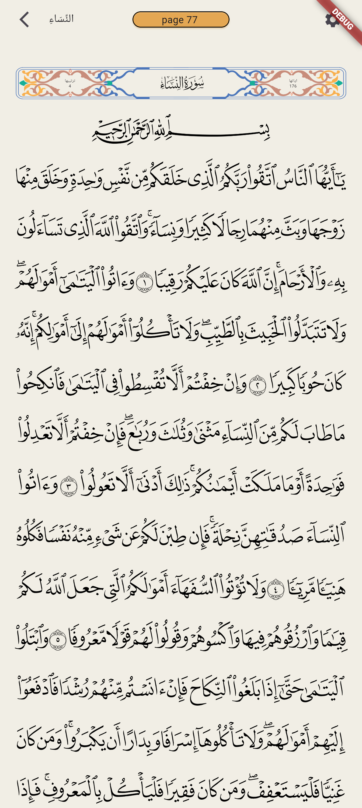
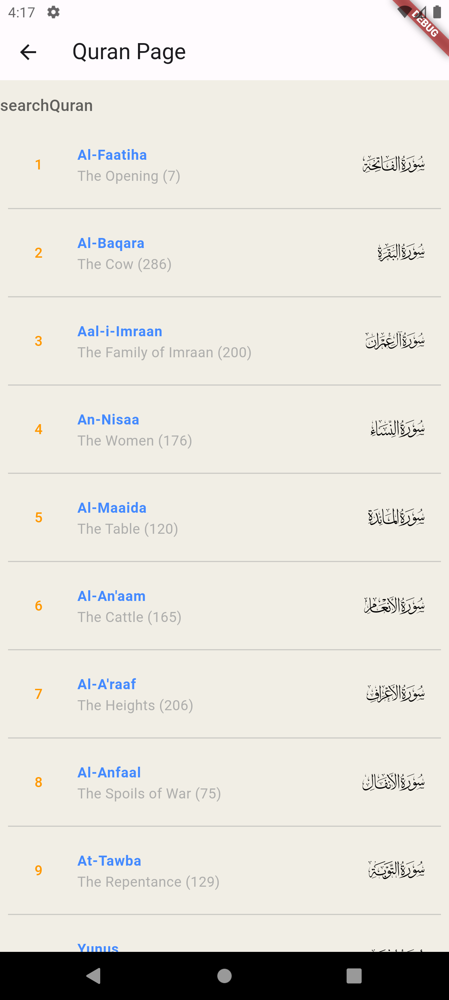

# Project Title

## Introduction

[](https://www.youtube.com/watch?v=s_6cvcFVP54&t=964s)

## Project Overview

This project is a quran app using flutter and qcf font.

## Screenshots

Here are some screenshots of the project:

<div style="display: flex; justify-content: space-around;">
  
  

</div>


## Installation

To get started with this project, follow these instructions:

1. Clone the repository:

   ```sh
   git clone https://github.com/Epic-Apps-Hub/quran-app